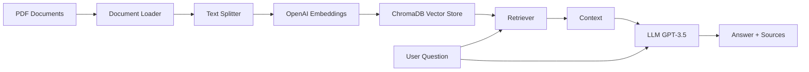

# 📚 Smart Document Q&A with RAG

> A production-ready Retrieval-Augmented Generation (RAG) system that enables intelligent question-answering over your PDF documents using OpenAI, LangChain, and ChromaDB.

[](https://www.python.org/downloads/)
[](https://github.com/langchain-ai/langchain)
[](https://openai.com/)
[](https://opensource.org/licenses/MIT)
[](https://github.com/fabao2024/Rag-doc-assistant)

**English Version** | [Versão em Português](README.pt-BR.md)

## 🎯 Overview

This project implements a modern RAG (Retrieval-Augmented Generation) pipeline that allows you to:
- 📄 Load and process PDF documents automatically
- 🔍 Ask natural language questions about your documents
- 💡 Get accurate, context-aware answers with source citations
- 🚀 Use state-of-the-art LangChain Expression Language (LCEL) patterns

**Perfect for:** Technical documentation, research papers, manuals, legal documents, or any PDF-based knowledge base.

## ✨ Features

- **Modern Architecture**: Built with LangChain 1.0+ using LCEL patterns
- **Persistent Vector Store**: ChromaDB for efficient document retrieval
- **Smart Chunking**: Recursive text splitting with configurable overlap
- **Source Tracking**: Always know which document sections informed the answer
- **Clean CLI Interface**: Simple command-line tool for querying documents
- **Production Ready**: Proper error handling, logging, and configuration management

## 🏗️ Architecture



**Pipeline Flow:**
1. **Document Ingestion**: PDFs are loaded and split into manageable chunks
2. **Embedding Generation**: Each chunk is converted to vector embeddings via OpenAI
3. **Vector Storage**: Embeddings stored in ChromaDB for fast retrieval
4. **Query Processing**: User questions are embedded and matched against stored vectors
5. **Answer Generation**: Retrieved context + question sent to GPT-3.5 for answer synthesis

## 🚀 Quick Start

### Prerequisites

- Python 3.8 or higher
- OpenAI API key ([Get one here](https://platform.openai.com/api-keys))
- (Optional) LangSmith API key for tracing ([Sign up](https://smith.langchain.com/))

### Installation

1. **Clone the repository**
   ```bash
   git clone https://github.com/fabao2024/Rag-doc-assistant.git
   cd Rag-doc-assistant
   ```

2. **Create virtual environment**
   ```bash
   python -m venv .venv
   
   # Windows
   .venv\Scripts\activate
   
   # macOS/Linux
   source .venv/bin/activate
   ```

3. **Install dependencies**
   ```bash
   pip install -r requirements.txt
   ```

4. **Configure environment variables**
   ```bash
   # Copy the example file
   cp .env.example .env
   
   # Edit .env and add your API keys
   # OPENAI_API_KEY=your_key_here
   ```

5. **Add your documents**
   ```bash
   # Place PDF files in the documents folder
   cp your_document.pdf documents/
   ```

6. **Build the vector store**
   ```bash
   .venv\Scripts\python.exe rag_script.py
   ```

## 💻 Usage

### Command Line Interface

Ask questions directly from your terminal:

```bash
.venv\Scripts\python.exe query.py "What are the main features of this product?"
```

**Example Output:**
```
================================================================================
QUESTION:
================================================================================
What are the main features of this product?

================================================================================
ANSWER:
================================================================================
Based on the documentation, the main features include:

1. Advanced safety systems with collision detection
2. Long-range battery (up to 400km on a single charge)
3. Fast charging capability (80% in 30 minutes)
4. Smart infotainment system with voice control
...

================================================================================
SOURCE DOCUMENTS (3 retrieved):
================================================================================

Source 1:
Page: 15
Content preview: The vehicle features a comprehensive safety suite including...
```

### Python API

Use the RAG system programmatically:

```python
from query import ask_question

# Ask a question
result = ask_question("How do I charge the vehicle?")

# Access the answer
print(result['result'])

# Access source documents
for doc in result['source_documents']:
    print(f"Page {doc.metadata['page']}: {doc.page_content[:100]}...")
```

### Interactive Mode

Run without arguments for interactive querying:

```bash
.venv\Scripts\python.exe query.py

Enter your question: What is the warranty period?
```

## 📁 Project Structure

```
rag-document-qa/
├── documents/              # 📄 Place your PDF files here
├── chroma_db/             # 🗄️ Vector database (auto-generated)
├── .venv/                 # 🐍 Virtual environment
├── rag_script.py          # 🔧 Main RAG pipeline setup
├── query.py               # 💬 CLI query interface
├── test_imports.py        # ✅ Verify dependencies
├── requirements.txt       # 📦 Python dependencies
├── .env.example           # 🔑 Environment template
├── .env                   # 🔐 Your API keys (gitignored)
├── .gitignore            # 🚫 Git exclusions
├── LICENSE               # ⚖️ MIT License
└── README.md             # 📖 This file
```

## ⚙️ Configuration

### Environment Variables

Create a `.env` file with the following:

```bash
# Required
OPENAI_API_KEY=sk-...

# Optional - for LangSmith tracing
LANGCHAIN_TRACING_V2=true
LANGCHAIN_ENDPOINT=https://api.smith.langchain.com
LANGCHAIN_API_KEY=lsv2_pt_...
LANGCHAIN_PROJECT=rag_project
```

### Customization

**Adjust chunk size** (in `rag_script.py`):
```python
splitter = RecursiveCharacterTextSplitter(
    chunk_size=1000,      # Increase for longer context
    chunk_overlap=200     # Overlap prevents context loss
)
```

**Change LLM model** (in `rag_script.py` or `query.py`):
```python
llm = ChatOpenAI(
    model="gpt-4",        # Use GPT-4 for better quality
    temperature=0         # 0 = deterministic, 1 = creative
)
```

**Modify retrieval count** (in `query.py`):
```python
retriever = vectorstore.as_retriever(search_kwargs={"k": 5})  # Retrieve top 5 chunks
```

## 🔧 Technical Details

### Dependencies

- **langchain** (1.0+): Framework for LLM applications
- **langchain-community**: Community integrations
- **langchain-openai**: OpenAI integration
- **langchain-text-splitters**: Text chunking utilities
- **chromadb**: Vector database
- **pypdf**: PDF parsing
- **openai**: OpenAI API client
- **python-dotenv**: Environment management

### Modern LangChain Patterns

This project uses **LCEL (LangChain Expression Language)**, the modern approach for building chains:

```python
# Modern LCEL pattern
rag_chain = (
    {"context": retriever | format_docs, "question": RunnablePassthrough()}
    | prompt
    | llm
    | StrOutputParser()
)
```

**Benefits:**
- ✅ More readable and composable
- ✅ Better error handling
- ✅ Easier to debug and modify
- ✅ Native streaming support

## 🐛 Troubleshooting

### Common Issues

**1. ModuleNotFoundError: No module named 'langchain.text_splitter'**

**Solution:** Update imports to use the new package structure:
```python
# Old (deprecated)
from langchain.text_splitter import RecursiveCharacterTextSplitter

# New (correct)
from langchain_text_splitters import RecursiveCharacterTextSplitter
```

**2. LangSmith "Forbidden" errors**

These are harmless telemetry errors. To disable:
```bash
# In .env
LANGCHAIN_TRACING_V2=false
```

**3. Empty documents folder error**

Make sure to add PDF files to the `documents/` folder before running `rag_script.py`.

**4. OpenAI API rate limits**

If you hit rate limits, consider:
- Using a paid OpenAI account
- Reducing chunk count in retrieval
- Adding retry logic with exponential backoff

## 📊 Performance

**Tested with:**
- Document: 257-page vehicle manual (4MB PDF)
- Chunks generated: 257
- Average query time: ~2-3 seconds
- Embedding model: text-embedding-ada-002
- LLM: gpt-3.5-turbo

## 🤝 Contributing

Contributions are welcome! Please feel free to submit a Pull Request.

1. Fork the repository
2. Create your feature branch (`git checkout -b feature/AmazingFeature`)
3. Commit your changes (`git commit -m 'Add some AmazingFeature'`)
4. Push to the branch (`git push origin feature/AmazingFeature`)
5. Open a Pull Request

## 📝 License

This project is licensed under the MIT License - see the [LICENSE](LICENSE) file for details.

## 🙏 Acknowledgments

- [LangChain](https://github.com/langchain-ai/langchain) for the amazing framework
- [OpenAI](https://openai.com/) for GPT and embedding models
- [ChromaDB](https://www.trychroma.com/) for the vector database

## 📧 Contact

**Fabio Pettian**
- LinkedIn: [linkedin.com/in/fabiopettian](https://www.linkedin.com/in/fabiopettian/)
- GitHub: [@fabao2024](https://github.com/fabao2024)

Project Link: [https://github.com/fabao2024/Rag-doc-assistant](https://github.com/fabao2024/Rag-doc-assistant)

---

⭐ If you found this project helpful, please consider giving it a star!
