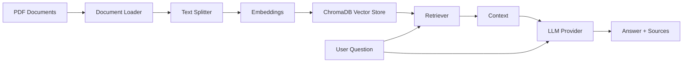

# 📚 Smart Document Q&A with RAG

> A production-ready Retrieval-Augmented Generation (RAG) system that enables intelligent question-answering over your PDF documents using multiple LLM providers (OpenAI, Ollama, Anthropic, Google, ZhipuAI, Azure) and ChromaDB.

[](https://www.python.org/downloads/)
[](https://github.com/langchain-ai/langchain)
[](https://opensource.org/licenses/MIT)
[](https://github.com/fabao2024/Rag-doc-assistant)

**English Version** | [Versão em Português](README.pt-BR.md)

## 🎯 Overview

This project implements a modern RAG (Retrieval-Augmented Generation) pipeline that allows you to:
- 📄 Load and process PDF documents automatically
- 🔍 Ask natural language questions about your documents
- 💡 Get accurate, context-aware answers with source citations
- 🚀 Use state-of-the-art LangChain Expression Language (LCEL) patterns

**Perfect for:** Technical documentation, research papers, manuals, legal documents, or any PDF-based knowledge base.

## ✨ Features

- **Multi-Provider LLM Support**: Use OpenAI, Ollama (local), Anthropic, Google Gemini, ZhipuAI, or Azure OpenAI
- **Local Inference**: Run with Ollama for zero API costs
- **Modern Architecture**: Built with LangChain 1.0+ using LCEL patterns
- **Persistent Vector Store**: ChromaDB for efficient document retrieval
- **Smart Chunking**: Recursive text splitting with configurable overlap
- **Source Tracking**: Always know which document sections informed the answer
- **Clean CLI Interface**: Simple command-line tool for querying documents
- **Comprehensive Logging**: File-based logging with configurable levels
- **Retry Logic**: Exponential backoff for API rate limits
- **Production Ready**: Proper error handling, logging, and configuration management

## 🏗️ Architecture



**Pipeline Flow:**
1. **Document Ingestion**: PDFs are loaded and split into manageable chunks
2. **Embedding Generation**: Each chunk is converted to vector embeddings
3. **Vector Storage**: Embeddings stored in ChromaDB for fast retrieval
4. **Query Processing**: User questions are embedded and matched against stored vectors
5. **Answer Generation**: Retrieved context + question sent to LLM for answer synthesis

## 🚀 Quick Start

### Prerequisites

- Python 3.8 or higher
- (Optional) LLM provider API key - or use Ollama for local inference

### Installation

1. **Clone the repository**
   ```bash
   git clone https://github.com/fabao2024/Rag-doc-assistant.git
   cd Rag-doc-assistant
   ```

2. **Create virtual environment**
   ```bash
   python -m venv .venv

   # Windows
   .venv\Scripts\activate

   # macOS/Linux
   source .venv/bin/activate
   ```

3. **Install dependencies**
   ```bash
   pip install -r requirements.txt
   ```

4. **Configure environment variables**
   ```bash
   # Copy the example file
   copy .env.example .env

   # Edit .env and configure your LLM provider
   ```

5. **Add your documents**
   ```bash
   # Place PDF files in the documents folder
   copy your_document.pdf documents/
   ```

6. **Build the vector store**
   ```bash
   .venv\Scripts\python.exe rag_script.py
   ```

## 💻 Usage

### Choose Your LLM Provider

#### Option 1: Ollama (Local - Free!)
```bash
# Install Ollama: https://ollama.ai
# Run: ollama serve

LLM_PROVIDER=ollama
OLLAMA_MODEL=qwen2.5-coder:7b
```

#### Option 2: OpenAI
```bash
LLM_PROVIDER=openai
OPENAI_API_KEY=sk-...
OPENAI_MODEL=gpt-3.5-turbo
```

#### Option 3: Anthropic (Claude)
```bash
LLM_PROVIDER=anthropic
ANTHROPIC_API_KEY=sk-ant-...
ANTHROPIC_MODEL=claude-3-haiku-20240307
```

#### Option 4: Google (Gemini)
```bash
LLM_PROVIDER=google
GOOGLE_API_KEY=AIza...
GOOGLE_MODEL=gemini-pro
```

#### Option 5: ZhipuAI (GLM)
```bash
LLM_PROVIDER=zhipuai
ZHIPUAI_API_KEY=your_key
ZHIPUAI_MODEL=glm-4
```

#### Option 6: Azure OpenAI
```bash
LLM_PROVIDER=azure
AZURE_OPENAI_API_KEY=your_key
AZURE_OPENAI_ENDPOINT=https://your-resource.openai.azure.com/
AZURE_OPENAI_DEPLOYMENT=gpt-35-turbo
```

### Command Line Interface

Ask questions directly from your terminal:

```bash
.venv\Scripts\python.exe query.py "What are the main features of this product?"
```

**Example Output:**
```
================================================================================
QUESTION:
================================================================================
What are the main features of this product?

================================================================================
ANSWER:
================================================================================
Based on the documentation, the main features include:

1. Advanced safety systems with collision detection
2. Long-range battery (up to 400km on a single charge)
3. Fast charging capability (80% in 30 minutes)
4. Smart infotainment system with voice control
...

================================================================================
SOURCE DOCUMENTS (3 retrieved):
================================================================================

Source 1:
Page: 15
Content preview: The vehicle features a comprehensive safety suite including...
```

### Python API

Use the RAG system programmatically:

```python
from query import ask_question, load_vector_store, create_rag_chain

# Load vector store and create chain
vectorstore = load_vector_store()
rag_chain, retriever = create_rag_chain(vectorstore)

# Ask a question
result = ask_question(rag_chain, retriever, "How do I charge the vehicle?")

# Access the answer
print(result['result'])

# Access source documents
for doc in result['source_documents']:
    print(f"Page {doc.metadata.get('page', 'N/A')}: {doc.page_content[:100]}...")
```

### Interactive Mode

Run without arguments for interactive querying:

```bash
.venv\Scripts\python.exe query.py

Enter your question: What is the warranty period?
```

## 📁 Project Structure

```
rag-document-qa/
├── documents/              # 📄 Place your PDF files here
├── chroma_db/             # 🗄️ Vector database (auto-generated)
├── logs/                  # 📝 Log files (auto-generated)
├── .venv/                 # 🐍 Virtual environment
├── rag_script.py          # 🔧 Main RAG pipeline setup
├── query.py               # 💬 CLI query interface
├── llm_config.py         # 🔌 Multi-provider LLM configuration
├── CLAUDE.md              # 📖 Claude AI assistant documentation
├── requirements.txt       # 📦 Python dependencies
├── .env.example          # 🔑 Environment template
├── .env                  # 🔐 Your API keys (gitignored)
├── .gitignore            # 🚫 Git exclusions
├── LICENSE               # ⚖️ MIT License
└── README.md             # 📖 This file
```

## ⚙️ Configuration

### Environment Variables

Create a `.env` file with your provider configuration:

```bash
# Required - Choose your provider
LLM_PROVIDER=ollama  # openai, anthropic, google, zhipuai, azure, ollama

# OpenAI (example)
OPENAI_API_KEY=sk-...

# Ollama (example)
OLLAMA_MODEL=qwen2.5-coder:7b

# Optional - Retrieval configuration
RETRIEVAL_K=3
CHUNK_SIZE=1000
CHUNK_OVERLAP=200

# Optional - Logging configuration
LOG_DIR=./logs
LOG_LEVEL=INFO

# Optional - Retry configuration
MAX_RETRIES=3
RETRY_DELAY=1.0
RETRY_BACKOFF=2.0
```

### Customization

**Adjust chunk size**:
```python
splitter = RecursiveCharacterTextSplitter(
    chunk_size=1000,      # Increase for longer context
    chunk_overlap=200     # Overlap prevents context loss
)
```

**Modify retrieval count**:
```python
retriever = vectorstore.as_retriever(search_kwargs={"k": 5})  # Retrieve top 5 chunks
```

## 🔧 Technical Details

### Dependencies

- **langchain** (1.0+): Framework for LLM applications
- **langchain-community**: Community integrations
- **langchain-openai**: OpenAI integration
- **langchain-text-splitters**: Text chunking utilities
- **chromadb**: Vector database
- **pypdf**: PDF parsing
- **python-dotenv**: Environment management

### Modern LangChain Patterns

This project uses **LCEL (LangChain Expression Language)**, the modern approach for building chains:

```python
# Modern LCEL pattern
rag_chain = (
    {"context": retriever | format_docs, "question": RunnablePassthrough()}
    | prompt
    | llm
    | StrOutputParser()
)
```

**Benefits:**
- ✅ More readable and composable
- ✅ Better error handling
- ✅ Easier to debug and modify
- ✅ Native streaming support

## 🐛 Troubleshooting

### Common Issues

**1. LangSmith "Forbidden" errors**

These are harmless telemetry errors. To disable:
```bash
# In .env
LANGCHAIN_TRACING_V2=false
```

**2. Empty documents folder error**

Make sure to add PDF files to the `documents/` folder before running `rag_script.py`.

**3. Ollama model not found**

Make sure the model is pulled:
```bash
ollama pull qwen2.5-coder:7b
```

**4. API rate limits**

The system includes automatic retry logic with exponential backoff. If issues persist:
- Using a paid API account
- Reducing chunk count in retrieval
- Using Ollama for local inference (free!)

## 📊 Performance

**Tested with:**
- Document: 257-page vehicle manual (4MB PDF)
- Chunks generated: 555
- Average query time: ~2-5 seconds (varies by provider)
- Embedding model: text-embedding-ada-002

## 🤝 Contributing

Contributions are welcome! Please feel free to submit a Pull Request.

1. Fork the repository
2. Create your feature branch (`git checkout -b feature/AmazingFeature`)
3. Commit your changes (`git commit -m 'Add some AmazingFeature'`)
4. Push to the branch (`git push origin feature/AmazingFeature`)
5. Open a Pull Request

## 📝 License

This project is licensed under the MIT License - see the [LICENSE](LICENSE) file for details.

## 🙏 Acknowledgments

- [LangChain](https://github.com/langchain-ai/langchain) for the amazing framework
- [ChromaDB](https://www.trychroma.com/) for the vector database
- [Ollama](https://ollama.ai/) for local LLM inference
- All LLM providers (OpenAI, Anthropic, Google, ZhipuAI)

## 📧 Contact

**Fabio Pettian**
- LinkedIn: [linkedin.com/in/fabiopettian](https://www.linkedin.com/in/fabiopettian/)
- GitHub: [@fabao2024](https://github.com/fabao2024)

Project Link: [https://github.com/fabao2024/Rag-doc-assistant](https://github.com/fabao2024/Rag-doc-assistant)

---

⭐ If you found this project helpful, please consider giving it a star!
