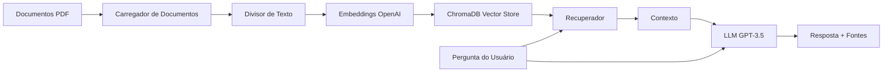

# 📚 Perguntas e Respostas Inteligentes sobre Documentos com RAG

> Um sistema de Geração Aumentada por Recuperação (RAG) pronto para produção que permite perguntas e respostas inteligentes sobre seus documentos PDF usando OpenAI, LangChain e ChromaDB.

[](https://www.python.org/downloads/)
[](https://github.com/langchain-ai/langchain)
[](https://openai.com/)
[](https://opensource.org/licenses/MIT)
[](https://github.com/fabao2024/Rag-doc-assistant)

[English Version](README.md) | **Versão em Português**

## 🎯 Visão Geral

Este projeto implementa um pipeline RAG (Retrieval-Augmented Generation) moderno que permite:
- 📄 Carregar e processar documentos PDF automaticamente
- 🔍 Fazer perguntas em linguagem natural sobre seus documentos
- 💡 Obter respostas precisas e contextualizadas com citações de fonte
- 🚀 Usar padrões de ponta da LangChain Expression Language (LCEL)

**Perfeito para:** Documentação técnica, artigos de pesquisa, manuais, documentos legais ou qualquer base de conhecimento em PDF.

## ✨ Funcionalidades

- **Arquitetura Moderna**: Construído com LangChain 1.0+ usando padrões LCEL
- **Armazenamento Vetorial Persistente**: ChromaDB para recuperação eficiente de documentos
- **Divisão Inteligente**: Divisão recursiva de texto com sobreposição configurável
- **Rastreamento de Fontes**: Sempre saiba quais seções do documento informaram a resposta
- **Interface CLI Limpa**: Ferramenta de linha de comando simples para consultar documentos
- **Pronto para Produção**: Tratamento adequado de erros, logging e gerenciamento de configuração

## 🏗️ Arquitetura



**Fluxo do Pipeline:**
1. **Ingestão de Documentos**: PDFs são carregados e divididos em pedaços gerenciáveis
2. **Geração de Embeddings**: Cada pedaço é convertido em embeddings vetoriais via OpenAI
3. **Armazenamento Vetorial**: Embeddings armazenados no ChromaDB para recuperação rápida
4. **Processamento de Consultas**: Perguntas do usuário são incorporadas e comparadas com vetores armazenados
5. **Geração de Respostas**: Contexto recuperado + pergunta enviados ao GPT-3.5 para síntese da resposta

## 🚀 Início Rápido

### Pré-requisitos

- Python 3.8 ou superior
- Chave de API OpenAI ([Obtenha aqui](https://platform.openai.com/api-keys))
- (Opcional) Chave de API LangSmith para rastreamento ([Inscreva-se](https://smith.langchain.com/))

### Instalação

1. **Clone o repositório**
   ```bash
   git clone https://github.com/fabao2024/Rag-doc-assistant.git
   cd Rag-doc-assistant
   ```

2. **Crie um ambiente virtual**
   ```bash
   python -m venv .venv
   
   # Windows
   .venv\Scripts\activate
   
   # macOS/Linux
   source .venv/bin/activate
   ```

3. **Instale as dependências**
   ```bash
   pip install -r requirements.txt
   ```

4. **Configure as variáveis de ambiente**
   ```bash
   # Copie o arquivo de exemplo
   cp .env.example .env
   
   # Edite .env e adicione suas chaves de API
   # OPENAI_API_KEY=sua_chave_aqui
   ```

5. **Adicione seus documentos**
   ```bash
   # Coloque arquivos PDF na pasta documents
   cp seu_documento.pdf documents/
   ```

6. **Construa o armazenamento vetorial**
   ```bash
   .venv\Scripts\python.exe rag_script.py
   ```

## 💻 Uso

### Interface de Linha de Comando

Faça perguntas diretamente do seu terminal:

```bash
.venv\Scripts\python.exe query.py "Quais são as principais características deste produto?"
```

**Exemplo de Saída:**
```
================================================================================
PERGUNTA:
================================================================================
Quais são as principais características deste produto?

================================================================================
RESPOSTA:
================================================================================
Com base na documentação, as principais características incluem:

1. Sistemas de segurança avançados com detecção de colisão
2. Bateria de longo alcance (até 400km com uma única carga)
3. Capacidade de carregamento rápido (80% em 30 minutos)
4. Sistema de infoentretenimento inteligente com controle por voz
...

================================================================================
DOCUMENTOS FONTE (3 recuperados):
================================================================================

Fonte 1:
Página: 15
Prévia do conteúdo: O veículo apresenta um conjunto abrangente de segurança incluindo...
```

### API Python

Use o sistema RAG programaticamente:

```python
from query import ask_question

# Faça uma pergunta
result = ask_question("Como faço para carregar o veículo?")

# Acesse a resposta
print(result['result'])

# Acesse documentos fonte
for doc in result['source_documents']:
    print(f"Página {doc.metadata['page']}: {doc.page_content[:100]}...")
```

### Modo Interativo

Execute sem argumentos para consulta interativa:

```bash
.venv\Scripts\python.exe query.py

Digite sua pergunta: Qual é o período de garantia?
```

## 📁 Estrutura do Projeto

```
rag-doc-assistant/
├── documents/              # 📄 Coloque seus arquivos PDF aqui
├── chroma_db/             # 🗄️ Banco de dados vetorial (gerado automaticamente)
├── .venv/                 # 🐍 Ambiente virtual
├── rag_script.py          # 🔧 Configuração principal do pipeline RAG
├── query.py               # 💬 Interface CLI de consulta
├── test_imports.py        # ✅ Verificar dependências
├── requirements.txt       # 📦 Dependências Python
├── .env.example           # 🔑 Template de ambiente
├── .env                   # 🔐 Suas chaves de API (gitignored)
├── .gitignore            # 🚫 Exclusões do Git
├── LICENSE               # ⚖️ Licença MIT
├── README.md             # 📖 Versão em inglês
└── README.pt-BR.md       # 📖 Este arquivo
```

## ⚙️ Configuração

### Variáveis de Ambiente

Crie um arquivo `.env` com o seguinte:

```bash
# Obrigatório
OPENAI_API_KEY=sk-...

# Opcional - para rastreamento LangSmith
LANGCHAIN_TRACING_V2=true
LANGCHAIN_ENDPOINT=https://api.smith.langchain.com
LANGCHAIN_API_KEY=lsv2_pt_...
LANGCHAIN_PROJECT=rag_project
```

### Personalização

**Ajustar tamanho do chunk** (em `rag_script.py`):
```python
splitter = RecursiveCharacterTextSplitter(
    chunk_size=1000,      # Aumente para contexto mais longo
    chunk_overlap=200     # Sobreposição evita perda de contexto
)
```

**Mudar modelo LLM** (em `rag_script.py` ou `query.py`):
```python
llm = ChatOpenAI(
    model="gpt-4",        # Use GPT-4 para melhor qualidade
    temperature=0         # 0 = determinístico, 1 = criativo
)
```

**Modificar contagem de recuperação** (em `query.py`):
```python
retriever = vectorstore.as_retriever(search_kwargs={"k": 5})  # Recuperar top 5 chunks
```

## 🔧 Detalhes Técnicos

### Dependências

- **langchain** (1.0+): Framework para aplicações LLM
- **langchain-community**: Integrações da comunidade
- **langchain-openai**: Integração OpenAI
- **langchain-text-splitters**: Utilitários de divisão de texto
- **chromadb**: Banco de dados vetorial
- **pypdf**: Análise de PDF
- **openai**: Cliente da API OpenAI
- **python-dotenv**: Gerenciamento de ambiente

### Padrões Modernos do LangChain

Este projeto usa **LCEL (LangChain Expression Language)**, a abordagem moderna para construir chains:

```python
# Padrão LCEL moderno
rag_chain = (
    {"context": retriever | format_docs, "question": RunnablePassthrough()}
    | prompt
    | llm
    | StrOutputParser()
)
```

**Benefícios:**
- ✅ Mais legível e componível
- ✅ Melhor tratamento de erros
- ✅ Mais fácil de depurar e modificar
- ✅ Suporte nativo a streaming

## 🐛 Solução de Problemas

### Problemas Comuns

**1. ModuleNotFoundError: No module named 'langchain.text_splitter'**

**Solução:** Atualize as importações para usar a nova estrutura de pacotes:
```python
# Antigo (descontinuado)
from langchain.text_splitter import RecursiveCharacterTextSplitter

# Novo (correto)
from langchain_text_splitters import RecursiveCharacterTextSplitter
```

**2. Erros "Forbidden" do LangSmith**

Estes são erros de telemetria inofensivos. Para desabilitar:
```bash
# No .env
LANGCHAIN_TRACING_V2=false
```

**3. Erro de pasta de documentos vazia**

Certifique-se de adicionar arquivos PDF à pasta `documents/` antes de executar `rag_script.py`.

**4. Limites de taxa da API OpenAI**

Se você atingir limites de taxa, considere:
- Usar uma conta paga da OpenAI
- Reduzir a contagem de chunks na recuperação
- Adicionar lógica de retry com backoff exponencial

## 📊 Performance

**Testado com:**
- Documento: Manual de veículo de 257 páginas (PDF de 4MB)
- Chunks gerados: 257
- Tempo médio de consulta: ~2-3 segundos
- Modelo de embedding: text-embedding-ada-002
- LLM: gpt-3.5-turbo

## 🤝 Contribuindo

Contribuições são bem-vindas! Sinta-se à vontade para enviar um Pull Request.

1. Faça um fork do repositório
2. Crie sua branch de feature (`git checkout -b feature/RecursoIncrivel`)
3. Commit suas mudanças (`git commit -m 'Adiciona algum RecursoIncrivel'`)
4. Push para a branch (`git push origin feature/RecursoIncrivel`)
5. Abra um Pull Request

## 📝 Licença

Este projeto está licenciado sob a Licença MIT - veja o arquivo [LICENSE](LICENSE) para detalhes.

## 🙏 Agradecimentos

- [LangChain](https://github.com/langchain-ai/langchain) pelo framework incrível
- [OpenAI](https://openai.com/) pelos modelos GPT e embeddings
- [ChromaDB](https://www.trychroma.com/) pelo banco de dados vetorial

## 📧 Contato

**Fabio Pettian**
- LinkedIn: [linkedin.com/in/fabiopettian](https://www.linkedin.com/in/fabiopettian/)
- GitHub: [@fabao2024](https://github.com/fabao2024)

Link do Projeto: [https://github.com/fabao2024/Rag-doc-assistant](https://github.com/fabao2024/Rag-doc-assistant)

---

⭐ Se você achou este projeto útil, considere dar uma estrela!
